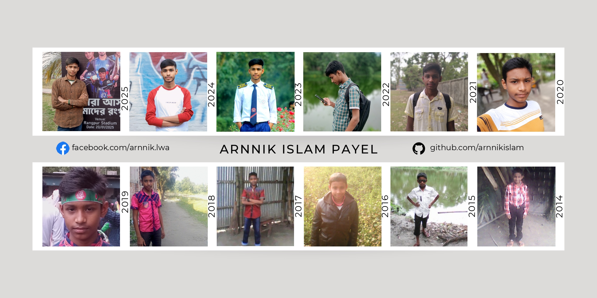

<!-- Banner Image -->



<h1 align="center">Hey there, I'm <span style="color:#00ADB5;">Arnnik Islam Payel</span>  </h1>
<h3 align="center">Student | Aspiring Web Developer | Wi-Fi Pentester | Tech Content Creator</h3>

---

<p align="center">
  <a href="https://youtube.com/@learnwitharnnik"></a>
  <a href="https://arnnikislam.github.io"></a>
  <a href="https://github.com/arnnikislam"></a>
  <a href="https://facebook.com/arnnik.lwa"></a>
  <a href="https://twitter.com/arnnikislam"></a>
  <a href="https://linkedin.com/in/arnnikislam"></a>
  <a href="https://www.instagram.com"></a>
  <a href="https://www.reddit.com"></a>
</p>
<p align="center">
  
  
</p>

---

## 🧑‍💻 About Me

Hey! I’m **Payel**, a student from Bangladesh  who’s passionate about tech, building cool stuff with code, and ethical hacking. Currently, I’m learning web development, creating content on YouTube, and exploring WiFi security.

- 🌱 Focused on **HTML, CSS**, Git, and real-life hacking tools.
- 🎯 Dream: Get into a top public university as an engineer.
- ✍️ Love building projects, documenting learning, and teaching through content.

---

## 🎓 Education

| **Degree/Certification** | **Institution**                          | **Grade/Focus** | **Year**  |
| ------------------------ | ---------------------------------------- | --------------- | --------- |
| **Intermediate**         | Rangpur Govt. College                    | Science         | 2024–2026 |
| **SSC (GPA 5.00)**       | Dimla Rani Brinda Rani Govt. High School | Science         | 2024      |
| **JSC**                  | Dimla Rani Brinda Rani Govt. High School | General         | 2021      |
| **PEC (GPA 5.00)**       | Nur Biddya Niketon                       | General         | 2018      |

---

## 🧠 Currently Learning

- Deep dive into **HTML & CSS**.
- Git & GitHub for collaborative workflows.
- Basics of **Kali Linux** for ethical hacking.
- WiFi penetration testing tools like **Fluxion**, **Airgeddon**, and **Wifite**.

---

## 🛠️ Tech Stack


![CSS3][def]


	
  
  
  

---

```bash
💻 Languages:        HTML, CSS (learning), JS (soon)
🧰 Tools/Platforms:  GitHub, Kali Linux (VM), Canva, VS Code
🕶️ Hacking Tools:   Fluxion, Airgeddon, Wifite, Wifiphisher, Aircrack-ng
```

---

## 🎥 Latest YouTube Videos

<!-- BEGIN YOUTUBE-CARDS -->

[](https://www.youtube.com/watch?v=Gdhp8D_XOeE)
[](https://www.youtube.com/watch?v=OuwF7n57pJU)
[](https://www.youtube.com/watch?v=LVxrVplx6cE)
[![[English] How to change wifi Mac address in mobile | Bypass wifi Mac filtering](https://ytcards.demolab.com/?id=hcJwi8N4nqQ&title=%5BEnglish%5D+How+to+change+wifi+Mac+address+in+mobile+%7C+Bypass+wifi+Mac+filtering&lang=en&timestamp=1645976568&background_color=%230d1117&title_color=%23ffffff&stats_color=%23dedede&max_title_lines=1&width=250&border_radius=5)](https://www.youtube.com/watch?v=hcJwi8N4nqQ)
[](https://www.youtube.com/watch?v=jvi7CTkzx2U)
[](https://www.youtube.com/watch?v=KGGh-QnQtoM)

<!-- END YOUTUBE-CARDS -->

---

## 📊 GitHub Stats:

<br/>
<br/>


---

[](https://visitcount.itsvg.in)

[def]: https://img.shields.io/badge/css3-%231572B6.svg?style=for-the-badge&logo=css3&logoColor=white

```markdown
<!-- 
Credits: 
### 🙏 Acknowledgments
Special thanks to the following amazing creators and resources that inspired and supported this project.

1. Learn with Summit - https://github.com/learnwithsumit/learnwithsumit
2. Hasin Hyder - https://github.com/hasinhayder/hasinhayder
3. Anisul Islam - https://github.com/anisul-Islam/anisul-Islam
4. Rabbil Hasan - https://github.com/anisul-Islam/anisul-Islam
5. Magdeline - https://github.com/xsol05/xsol05/
6. GitHub Stats - https://github.com/anuraghazra/github-readme-stats
7. YouTube Card - https://github.com/DenverCoder1/github-readme-youtube-cards
8. Markdown Badges - https://github.com/Ileriayo/markdown-badges?tab=readme-ov-file
-->
```
